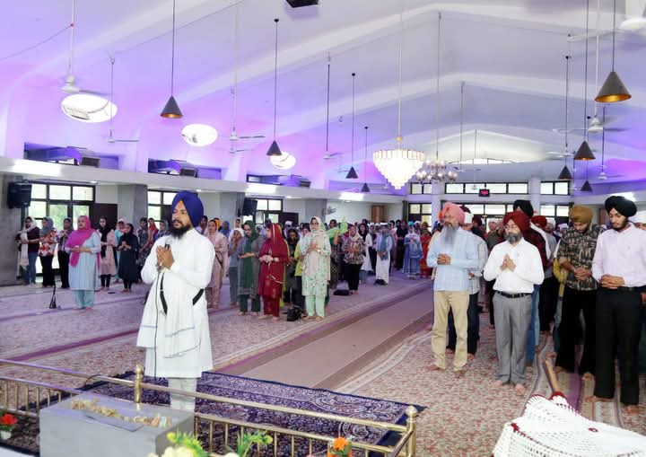
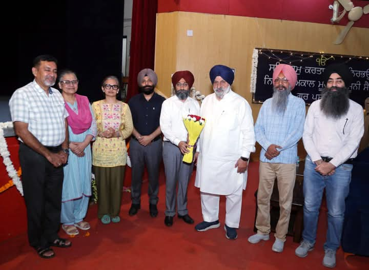
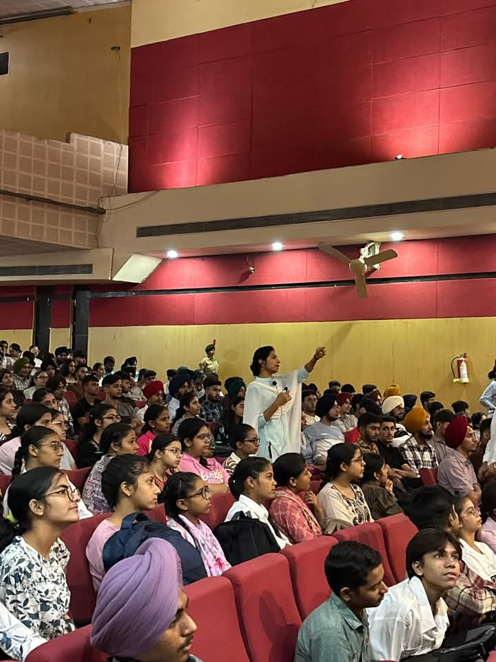
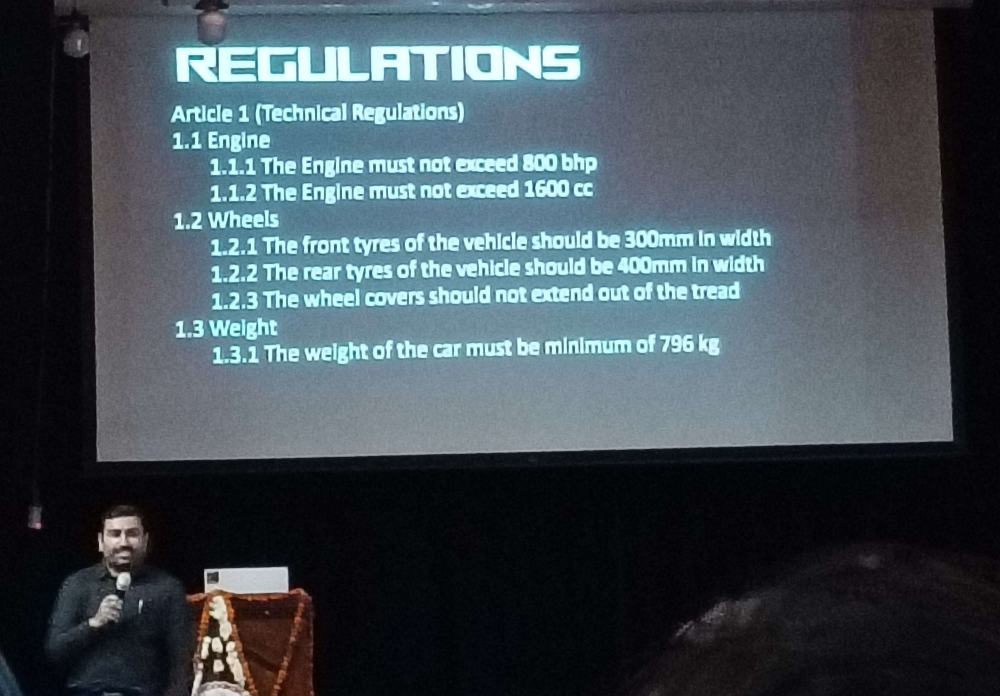
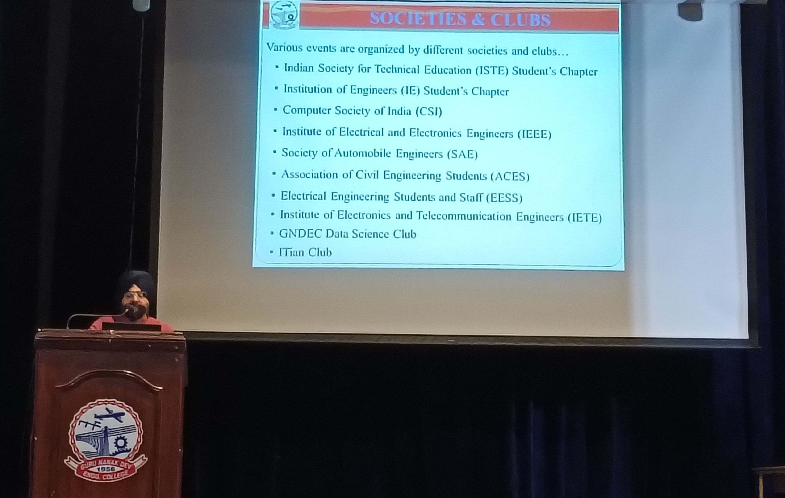
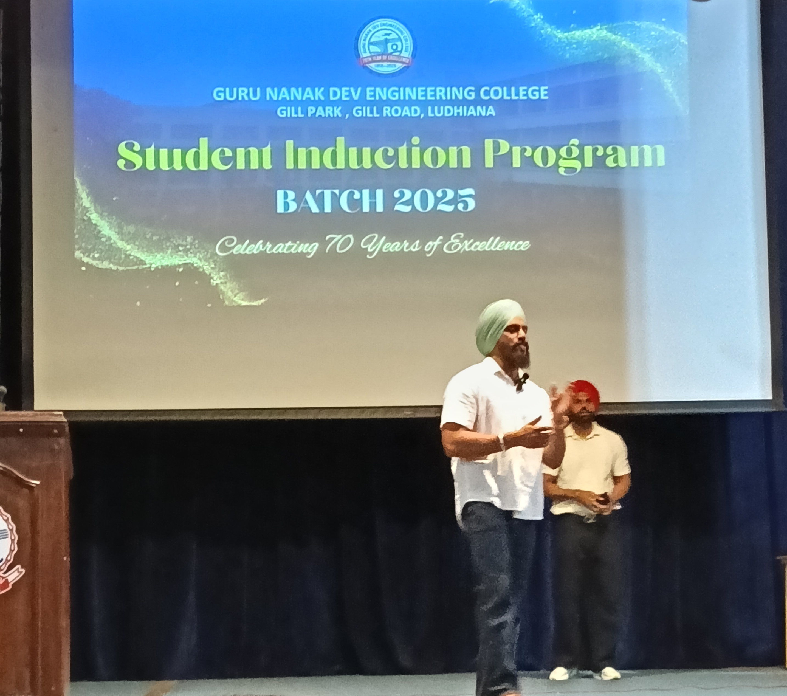
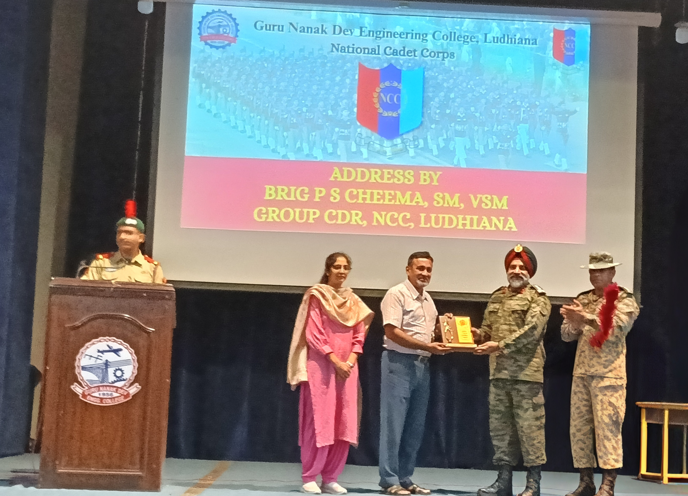

# Induction Programme
### Gurpreet Kaur ECA
## Day 1: 30 July 2025
My college journey at GNDEC Ludhiana began with a peaceful and spiritual experience. The day started with a programme at the **Gurdwara Sahib (8:30 AM – 9:30 AM)**, where we attended the **recitation of Japji Sahib, followed by Kirtan and Ardaas** for the success of our batch. It was a beautiful start to this new chapter of life.
The Gurdwara Sahib at GNDEC is designed like a ship. Sitting inside felt like we were travelling together in the Jahaz of Waheguru — a peaceful and spiritual start to our day.

During this session, I met a girl who is also from my branch (ECE), and since then, we’ve been sharing this journey together — a bond I cherish.

Following the prayer, **tea and snacks were served at Hostel No. 2**, giving everyone a chance to interact informally. 

At **10:00 AM**, the **inauguration ceremony** began in the auditorium. After completing the registration process, we were warmly welcomed by **Taranpreet Kaur**, our senior and host for the event.

We were introduced to college life and its diverse activities by **Mr. Harsimran Singh**. Then, a series of valuable sessions were conducted by:

- **Dr. Sehijpal Singh**, Principal of GNDEC, who motivated us to dream big and make the most of our years ahead.
- **Dr. P.S. Grewal** from PAU, who congratulated us and offered insightful guidance.
- **Mrs. Harpreet Kaur Grewal**, HOD of Applied Sciences, who explained that the first year will be under her department and shared useful tips for adapting to college life.
- **S. Maheshinder Singh Grewal**, member of the **Nankana Sahib Education Trust**, who shared his inspiring personal experiences and welcomed us warmly.
- 

After a lunch break (12:30 – 1:30 PM), we were taken on a **guided campus tour** by our teachers and seniors. This helped us get familiar with the college environment and feel more comfortable.

The **induction programme concluded at 2:30 PM**, leaving me with unforgettable memories, a strong sense of belonging, and excitement for what’s to come.

## Day 2 – 1st August 2025

The second day of our induction began on a spiritual note with the **recitation of Mool Mantar**, as suggested by **Dr. Harpreet Kaur**, Head of the Applied Sciences Department. This peaceful start helped us calm our minds and set the tone for a meaningful day ahead.

After that, we had a thought-provoking session by **Dr. Priya Darshani**, PhD in ECE, on *Universal Human Values*. She spoke about how the **real goal in life is happiness**, not just material success. Her session made us realise how we’re often chasing physical comforts, while true joy lies in maintaining harmony with ourselves and others.

Next, **Dr. Arvind Dhingra**, Director-STEP and Incharge-TAC, gave us an insightful presentation on the different **clubs and societies** in college. To make the session more interactive, he invited students on stage for some **fun ice-breaker activities**, which really helped us connect with our classmates.

Then, we had a **lunch break** for an hour.

In the second half, we appeared for **proficiency tests** in **English and Maths**, each lasting one hour. These were conducted by our seniors and gave us a sense of where we currently stand in these subjects.And with that, the day came to an end — filled with learning, reflection, and bonding.

This day reminded us that college life is not just about academics. It’s equally about **personal growth, emotional well-being**, and forming meaningful connections with others. From **spiritual grounding to intellectual engagement**, Day 2 gave us a glimpse of the balanced journey ahead.

## Day 3 : 4 August 2025

We began our day with the spiritual recitation of the Mool Mantra in the presence of Dr. Harpreet Kaur, HoD of Applied Sciences.

The first session introduced us to GitHub, where we were guided on how to create a repository and upload our daily reports. It was our first exposure to version control and technical documentation.

Next, our senior Taranpreet Kaur from the Causmic Club gave a detailed talk about the club’s activities, Instagram presence, and how to become a member. This was followed by a fascinating session on Motorsports by a mechanical senior, who explained the role of engineering in racing.

Dr. Priya Darshani then delivered an interactive lecture on Universal Human Values, where she focused on how to maintain a balance between relationships, physical facilities, and right understanding. She also addressed questions from students and shared tips on overcoming indulgence and depression.

After lunch, Prof. Aastik Sharma took an English class where he encouraged everyone to introduce themselves and write a letter describing their first day of college. He motivated us to shed the fear of speaking English.

The day concluded with a Peer-to-Peer (P2P) session by our seniors who introduced us to basic C++ programming. We successfully ran our first "Hello World" program and learned about variables.

**Overall, Day 3 was enriching — full of spiritual energy, practical knowledge, and new beginnings.**

## 🌟 Day 4 – *5 August 2025*  

The fourth day of our induction program began with an insightful **Peer-to-Peer (P2P) lecture** at **1:30 PM**. This session was conducted by our senior **Abhinav**, a second-year student from the **CSE department**.

### 🧑‍🤝‍🧑 Peer to Peer Session  
Abhinav walked us through the vibrant side of college life by introducing us to the various **college societies, technical clubs, cultural groups, and activity cells**. He encouraged us to become a part of these communities to develop our personalities and grow beyond academics.  
He warmly welcomed our queries and ensured we could reach out to our seniors anytime if we faced any doubts or confusion during our journey at GNDEC.

### 🎤 Expert Talk by Mrs. Shaffy Makkar  
The second session was an engaging **expert lecture** by **Mrs. Shaffy Makkar**, Vice Principal of **GHSKMS, Ludhiana**, held in the **auditorium**. The topic of discussion was:  
> **"Millets – The Superfood of the Future"**

She enlightened us on the **nutritional importance of millets**, highlighting how they are not only climate-resilient but also packed with essential nutrients. She emphasized how common grains like wheat and rice are categorized as **negative millets**, and how replacing them with **positive millets** can boost our health.  
She also shared **various easy and delicious ways to cook millets**, ensuring both **maximum nutritional benefit and taste**.

The day was both informative and interactive. From learning about **college life through our senior's lens** to understanding **the significance of mindful eating** through the expert lecture, Day 4 added immense value to our induction journey.  
We walked away more informed, more connected, and definitely more curious!

## 🌟Day 5 - 6 August 2025

### 🕯️ Spiritual Start
The day began with the peaceful **recitation of Mool Mantra**, led by  
**Dr. Harpreet Kaur Grewal**, HOD of Applied Sciences.

### 🏛️ Orientation by Dean – Dr. Parminder Singh
**Dr. Parminder Singh**, Dean of Students’ Welfare, introduced us to:

- College norms & discipline  
- Hostel life  
- Clubs and societies  
- Campus facilities

### 💪 Fitness for Engineers – Mr. Manpreet Singh
A highly energetic session by **Mr. Manpreet Singh**, fitness trainer.  
He emphasized:

- Importance of physical fitness  
- Benefits of a home-based diet  
- Correct workout techniques  

### 🎖️ NCC Insights – Tanmay Kaushal & Brig. P.S. Cheema

- **Tanmay Kaushal**, senior, shared NCC training experiences.  
- **Brigadier P.S. Cheema** spoke on Emotional Intelligence (EI) and the "5 Fs" of life:

 🧠 **Fitness**, **Family & Friends**, **Finance**, **Faith**

### 📘 Physics Lecture – Prof. Amanjot Kaur

She discussed:

- Semester syllabus  
- Exam pattern  
- Class 12 topics used in Semester 1  

### 🏎️ Motorsports Talk – Gautam (Senior)

A fun and engaging session on **motorsports** in engineering by **Gautam**, one of our seniors.

Day 5 offered a perfect balance of **spirituality, discipline, health, academics, and emotional growth**.  
Each session left us inspired to become better engineers and individuals.

## ✨Day 6 - 7 August 2025

### 🧪 Physics Lab Readiness – Prof. Komalpreet Kaur
The day began with an informative lecture by **Prof. Komalpreet Kaur (Physics)**.  
She explained the **basic concepts required before attending lab sessions**, focusing especially on:
- ✅ Laser fundamentals  
- ✅ Safety and precision in physics lab  
- ✅ Importance of conceptual clarity  
Her teaching style was clear, engaging, and easy to follow — a perfect start to the day!

### ➗ Math Refresher – Prof. Sandeep Kaur Gill
Next, we had a mathematics session by **Prof. Sandeep Kaur Gill**, who gave a strong revision of key Class 12 concepts:
- 🔁 **Differential equations**  
- 📉 **Differentiation**  
- 🔍 **Partial vs. Ordinary Differentiation**
This lecture helped bridge the gap between school maths and engineering applications.

### 🎓 Exploring New Dimensions – Dr. Lakhvir Singh Khanna  
**Dr. Lakhvir Singh Khanna**, Incharge – *CML (Centre for Multi-faceted Learning)*, conducted a session in the auditorium.

He introduced us to:

- 🌐 **NPTEL platform** – Online courses by IIT professors  
- 🎓 Opportunity to earn a **B.Tech Honours degree** via NPTEL  
- 🌟 Skills beyond academics – communication, ethics, personality
The session was interactive, informative, and truly eye-opening!

### ❤️ Social Responsibility & Fun – NSS Session by Dr. Jasvir Singh Grewal  
The final session was led by **Dr. Jasvir Singh Grewal**, Incharge – *NSS (National Service Scheme)*.  
He sensitized us about:
- 🌍 Environmental care  
- 🐾 How animals suffer due to human actions  
- ❤️ Purpose of joining NSS and giving back to society
The session included **multiple engaging activities**:

### 🎶 Cultural Activities

- 🎤 **Shabad Kirtan**: *"ਮੇਰੇ ਲਾਲਨ ਕੀ ਸੋਭਾ"*  
- 🎵 **Classical Singing Performance**  

### 🎲 Interactive Game: *Make Each Other Laugh*  
A football was tossed into the audience. The chosen students were challenged to make each other laugh — but both resisted!  
**Lesson**: It’s much harder to bring laughter than we think.

### 🎭 Comedy Act by Seniors  
A fun-filled act performed by our seniors brought energy, laughter, and joy to the entire hall.

Day 6 blended **technical learning**, **career exploration**, and **cultural awareness** perfectly.  
From lasers and differential equations to NPTEL, NSS, and laughter — every moment was valuable.

Learning with purpose, and growing with joy — Day 6 was all about balance.
