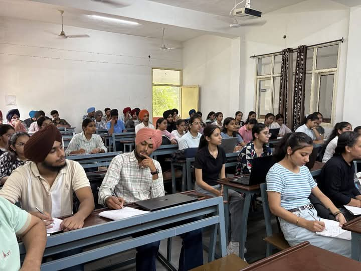

# Induction Programme
### Gurpreet Kaur ECA
## Day 1: 30 July 2025
My college journey at GNDEC Ludhiana began with a peaceful and spiritual experience. The day started with a programme at the **Gurdwara Sahib (8:30 AM – 9:30 AM)**, where we attended the **recitation of Japji Sahib, followed by Kirtan and Ardaas** for the success of our batch. It was a beautiful start to this new chapter of life.
The Gurdwara Sahib at GNDEC is designed like a ship. Sitting inside felt like we were travelling together in the Jahaz of Waheguru — a peaceful and spiritual start to our day.

During this session, I met a girl who is also from my branch (ECE), and since then, we’ve been sharing this journey together — a bond I cherish.

Following the prayer, **tea and snacks were served at Hostel No. 2**, giving everyone a chance to interact informally. 

At **10:00 AM**, the **inauguration ceremony** began in the auditorium. After completing the registration process, we were warmly welcomed by **Taranpreet Kaur**, our senior and host for the event.

We were introduced to college life and its diverse activities by **Mr. Harsimran Singh**. Then, a series of valuable sessions were conducted by:

- **Dr. Sehijpal Singh**, Principal of GNDEC, who motivated us to dream big and make the most of our years ahead.
- **Dr. P.S. Grewal** from PAU, who congratulated us and offered insightful guidance.
- **Mrs. Harpreet Kaur Grewal**, HOD of Applied Sciences, who explained that the first year will be under her department and shared useful tips for adapting to college life.
- **S. Maheshinder Singh Grewal**, member of the **Nankana Sahib Education Trust**, who shared his inspiring personal experiences and welcomed us warmly.
- 

After a lunch break (12:30 – 1:30 PM), we were taken on a **guided campus tour** by our teachers and seniors. This helped us get familiar with the college environment and feel more comfortable.

The **induction programme concluded at 2:30 PM**, leaving me with unforgettable memories, a strong sense of belonging, and excitement for what’s to come.

## Day 2 – 1st August 2025

The second day of our induction began on a spiritual note with the **recitation of Mool Mantar**, as suggested by **Dr. Harpreet Kaur**, Head of the Applied Sciences Department. This peaceful start helped us calm our minds and set the tone for a meaningful day ahead.

After that, we had a thought-provoking session by **Dr. Priya Darshani**, PhD in ECE, on *Universal Human Values*. She spoke about how the **real goal in life is happiness**, not just material success. Her session made us realise how we’re often chasing physical comforts, while true joy lies in maintaining harmony with ourselves and others.

Next, **Dr. Arvind Dhingra**, Director-STEP and Incharge-TAC, gave us an insightful presentation on the different **clubs and societies** in college. To make the session more interactive, he invited students on stage for some **fun ice-breaker activities**, which really helped us connect with our classmates.

Then, we had a **lunch break** for an hour.

In the second half, we appeared for **proficiency tests** in **English and Maths**, each lasting one hour. These were conducted by our seniors and gave us a sense of where we currently stand in these subjects.And with that, the day came to an end — filled with learning, reflection, and bonding.

This day reminded us that college life is not just about academics. It’s equally about **personal growth, emotional well-being**, and forming meaningful connections with others. From **spiritual grounding to intellectual engagement**, Day 2 gave us a glimpse of the balanced journey ahead.
